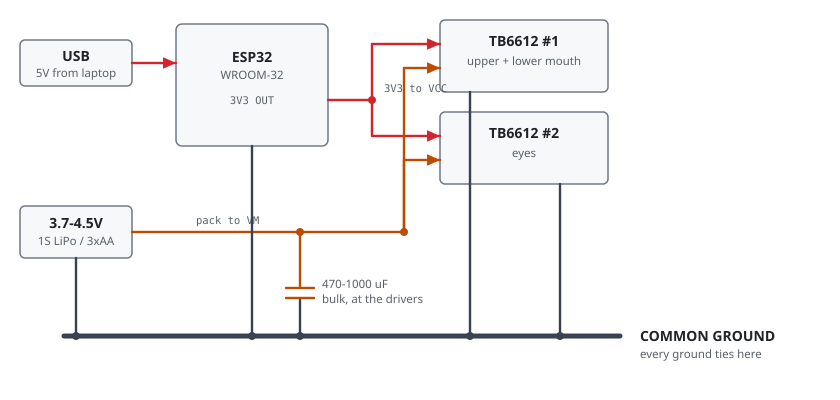
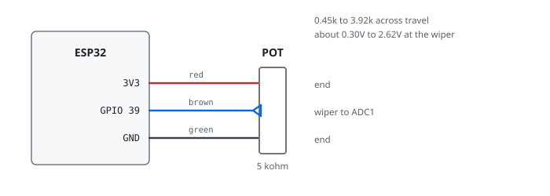

# Wiring

Bench wiring for the ESP32-WROOM-32, two TB6612FNG drivers, and the bear's three
original servos.

`wiring.html` in this folder is the same content as a self-contained page, with a
tickable connection checklist. Open it locally or serve it with GitHub Pages —
GitHub shows the source, not the render.

## Three supplies, one ground

Two independent supplies, one shared return. The ESP32 runs from USB on the
bench; the motors run from their own pack. Without the common ground the drivers
see no valid logic levels and the motors sit dead or twitch at random.

> **Never tie `VM` to `VCC`, and never run the motors from the ESP32's `3V3` or
> `VIN`** — not even though the motors are 3 V rated. The question is current,
> not voltage. That pin is the output of the devkit's AMS1117, already feeding
> the ESP32's own ~250 mA WiFi bursts off a 500 mA USB budget. Phase 1 stalls
> motors deliberately, and the regulator browns out mid-move.

Motor supply wants **3.7–4.5 V**. The TB6612 drops ~0.3–0.5 V across the bridge,
so 3 V in leaves the motor short; 3.7 V in lands about 3.3 V at the winding.
Don't use the bear's original 6 V — that fed the whole toy, and the servo
amplifier never put the full rail across a motor.

## Signal wiring

| Signal | GPIO | | Signal | GPIO |
|---|---|---|---|---|
| `AIN1` / `AIN2` / `PWMA` | 32 / 33 / 25 | | I2S out BCLK / LRCLK / DIN | 18 / 5 / 17 |
| `BIN1` / `BIN2` / `PWMB` | 26 / 27 / 14 | | I2S mic SCK / WS | 16 / 4 |
| `CIN1` / `CIN2` / `PWMC` | 13 / 23 / 22 | | I2S mic SD (input-only) | 15 |
| `STBY` (drivers A/B) | 21 | | | |
| `STBYC` (eyes) | 19 | | | |

Driver #1 carries both mouth channels; driver #2 uses channel A only for the
eyes, so its `BIN1`/`BIN2`/`PWMB` stay unconnected.

**Go by the silkscreen number, not the pin position.** Hosyond ships both 30-pin
and 38-pin ESP32 boards and the physical order differs between them.

### Pins that bite

- **GPIO 12 is unusable.** Strapping pin — high at boot selects the wrong flash
  voltage and the board won't start. Presents as a dead board.
- **GPIO 0 and 2** also strap. **6–11** are flash.
- **34–39 are input-only with no internal pull-ups.**
- WROVER modules use 16/17 for PSRAM; WROOM-32 is fine.

> **Keep external pulldowns on `STBY` and `STBYC`.** Between reset and the first
> line of `setup()` those pins float, and a floating standby pin twitches a motor
> on every boot.

## Motors: five wires, use two

Each plug carries **2 motor wires** (the pair with suppression capacitors across
them) and **3 potentiometer wires**. Only the motor pair goes to the driver.

Tell them apart in thirty seconds: the motor pair reads **2–30 Ω** and twitches
on a brief touch of a cell. On the pot, the two outer wires read a **fixed**
value that doesn't change as you turn the mechanism, while each outer-to-wiper
reading sweeps smoothly and the two always sum to that total.

Expect a motor to run backwards — swap its two output leads, or flip
`offsetA`/`offsetB`/`offsetC` in `Calibrate.ino`. The mouth needs upper and lower
opposed, so at least one very likely needs it.

## Potentiometer feedback

| Pot wire | Goes to |
|---|---|
| red (end) | `3V3` rail — shared by all three |
| green (end) | `GND` rail — shared by all three |
| upper wiper (brown) | `GPIO 34` |
| lower wiper (brown) | `GPIO 36` |
| eyes wiper (brown) | `GPIO 39` |

Only the wipers need their own pin. Three pots draw 2 mA total.

> **3.3 V only.** The pot ends go to `3V3` and `GND` — never 5 V, never `VM`. The
> wiper feeds an ADC input directly and anything above 3.3 V damages it. Getting
> this wrong back-feeds the pack into the board through the divider, which
> half-powers the ESP32 and stops it booting.

**Why these pins:** ADC2 is unusable while WiFi is running, so wipers must land
on ADC1 (GPIO 32–39). 34, 36 and 39 are also input-only, which suits an analog
input and costs no output pin.

## Before you power on

1. **Meter continuity between the grounds.** ESP32 `GND` to each driver's `GND`
   should read a short. Most common cause of "the motors do nothing".
2. **Meter `VM` against `VCC`.** They must *not* be connected.
3. **Check the electrolytic's polarity.** Stripe is negative, goes to ground.
4. **Power the motor pack first, USB second**, and watch for the ESP32 resetting
   when a motor starts — that's the brownout the bulk cap exists to prevent.
5. **Watch the first `home`.** A bench supply would catch a miswired H-bridge by
   current-limiting; batteries won't.

## Known bench gotchas

- **Motors couple EMI into the console UART.** Framing errors appear mid-
  transmission during drive. The firmware drops indented input so its own output
  can never parse as a command, and flushes RX after every move. Physically:
  keep motor leads away from the USB cable and twist each pair.
- **The gearbox can't be back-driven by hand** — high reduction. Use `sweep`,
  which drives the motor and samples the pot together.
- **Seized servos are the classic failure on these bears.** Forty years of
  hardened grease. Working the mechanism by hand frees them.
